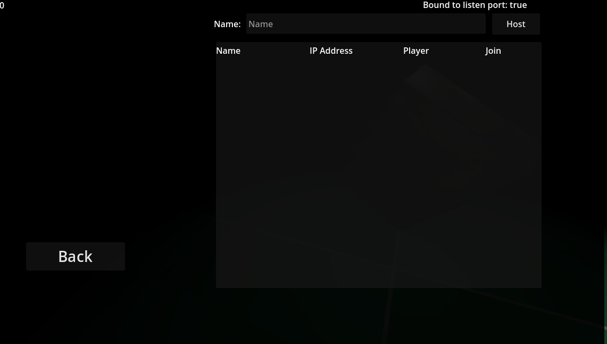
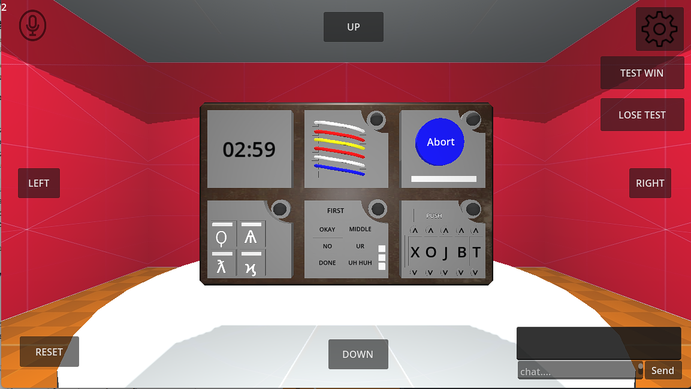
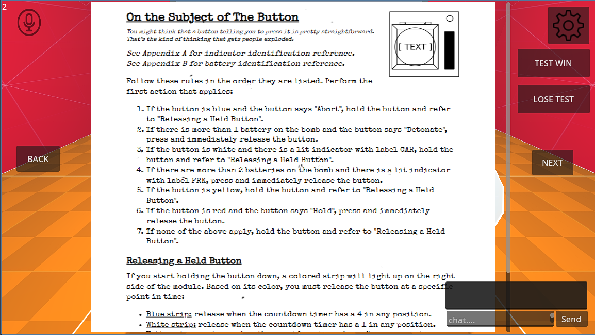

# 🎮 Two or Die

A cooperative bomb-defusal puzzle game inspired by **Keep Talking and Nobody Explodes**. Built using the **Godot Engine** and powered by **GDScript**, this game emphasizes communication, coordination, and trust between two players.

## 📌 Overview

In *Two or Die*, two players take on distinct roles:

- 🧨 **Defuser**: The player who can see and interact with the bomb modules.
- 📖 **Instructor**: The player who holds a randomly generated bomb manual and must guide the defuser using only descriptions.

The game is designed to challenge players’ communication skills as they race against the clock to defuse the bomb. It features LAN multiplayer, in-game voice/text chat, dynamic audio, and stylized visuals.

---

## 🧩 Game Features

- 🔀 **Randomized Bomb Modules** – Each game is unique with randomly generated instructions.
- 🎙️ **Voice & Text Chat** – Communicate effectively under pressure.
- 🎵 **Immersive Audio** – Tension-enhancing background music and sound effects.
- 🎨 **Customizable UI** – Tweak colors and styles to suit your preferences.
- 📶 **LAN Multiplayer** – Quick local connection between players.

---

## 📱 Platforms & Technology

- **Platform:** Android (mobile)
- **Engine:** [Godot Engine](https://godotengine.org/) (Open source)
- **Language:** GDScript

---

## 🖼️ Screenshots

### Main Menu


### LAN Lobby


### Defuser Side


### Instructor Side


---

## ⚠️ Known Limitations

- Voice chat stability depends on network quality.
- UI/UX design and effects are functional but not fully polished.
- Limited number of puzzle modules available in this version.
- No online ranking or progress tracking system implemented yet.

---

## ✅ Project Status

✔️ Working prototype with:
- Role-based cooperative gameplay
- Functional LAN multiplayer
- Voice and text chat
- Modular puzzle generation
- Integrated sound and basic visual polish

---

## 🚀 Getting Started

> Requires [Godot Engine](https://godotengine.org/) to run or export the project.

Clone the repository:

```bash
git clone https://github.com/LemonteaIsgood45/Two-or-die
